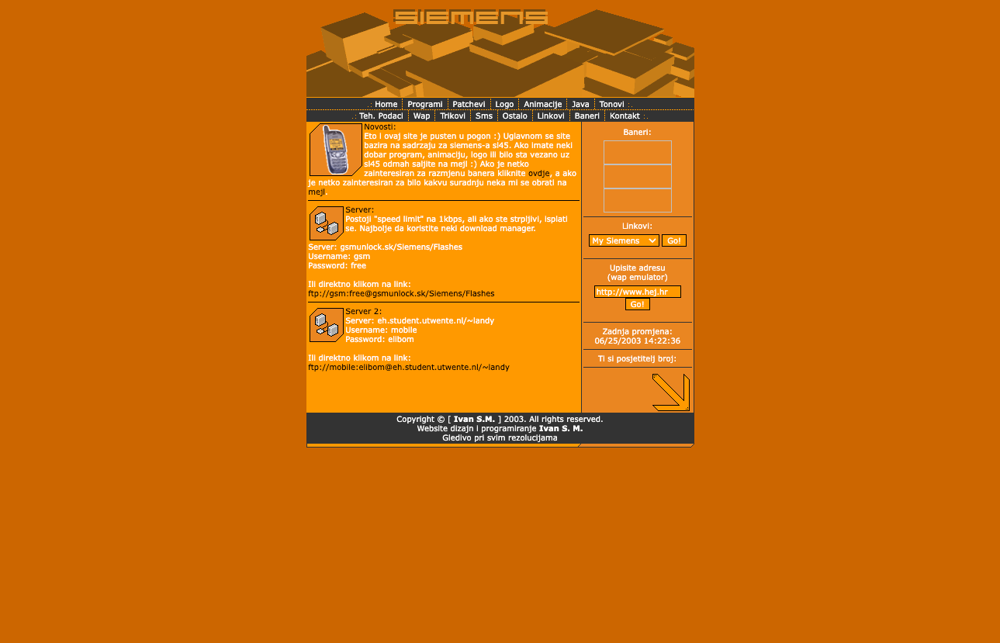

# Siemens SL45 Website

## About This Project

This repository hosts the original source code for my personal project: a website dedicated to customizing the Siemens SL45 mobile phone. Created in 2003, this website was a hub for Siemens SL45 enthusiasts, offering a range of resources including games, animations, wallpapers, patches, ringtones, and technical specifications. It also provided software for connecting the phone to your computer and shared various tips and tricks for phone customization.

### Background

This project was more than just a website; it was a journey where I connected my learning about web development, user interface design, and my passion for customizing my Siemens SL45 phone. It reflects my early experiences in web development and design, combining practical utility with a personal hobby.

### Technical Details

- **Frontend:** The website is built using simple HTML. It does not use CSS, relying instead on images, tables, and bgcolor attributes for styling.
- **Compatibility:** Designed for early 2000s web standards, best viewed in browsers from that era.

## How to Use

To view the website:

1. Clone the repository to your local machine.
2. Open the `index.html` file in a web browser.

---

_Siemens SL45 is a trademark of Siemens AG. This project is not affiliated with Siemens AG._
